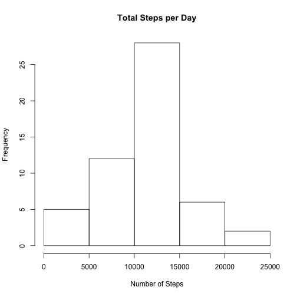
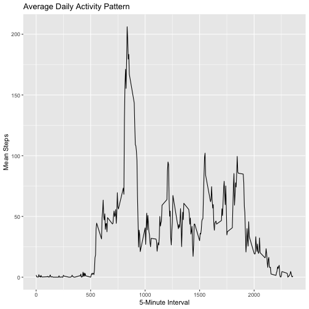
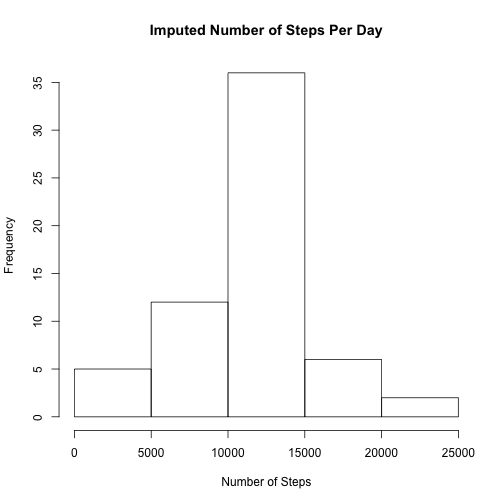
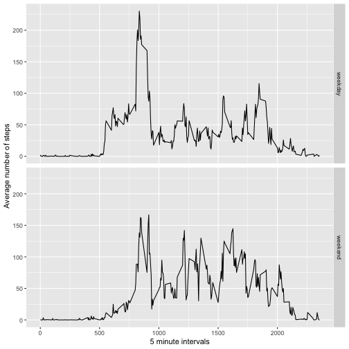

## Loading and preprocessing the data

The file is loaded and stored in the object, "activity"


```r
if (!file.exists('activity.csv')) {
  unzip(zipfile = "activity.zip")
}
activity <- read.csv("activity.csv", header = TRUE)
```


## What is mean total number of steps taken per day?


```r
total_steps <- aggregate(steps~date, activity, sum)
hist(total_steps$steps,
     xlab = "Number of Steps",
     ylab = "Frequency",
     main = "Total Steps per Day")
```



```r
mean_total_steps <- mean(total_steps$steps, na.rm = TRUE)
median_total_steps <- median(total_steps$steps, na.rm = TRUE)
```


## What is the average daily activity pattern?


```r
library(ggplot2)
steps_by_interval <- aggregate(steps~interval, activity, FUN = mean)

g <- ggplot(data = steps_by_interval, aes(x = interval, y = steps))
g + geom_line() + ggtitle("Average Daily Activity Pattern") + xlab("5-Minute Interval") + ylab("Mean Steps")
```



```r
print("The 5-Minute interval which contains the maximum number of steps on average is ")
```

```
## [1] "The 5-Minute interval which contains the maximum number of steps on average is "
```

```r
print(which(steps_by_interval$steps == max(steps_by_interval$steps)))      
```

```
## [1] 104
```

## Imputing missing values


```r
print(c("The total number of missing values in the dataset is ", sum(is.na(activity$steps))))
```

```
## [1] "The total number of missing values in the dataset is " "2304"
```

```r
activity_new <- activity                                        # creating a new dataframe
missing_indices <- which(is.na(activity$steps))                 # finding the indices that has missing values
mean_by_interval <- aggregate(steps~interval, activity, mean)   # mean of intervals

number_of_missing_indices <- length(missing_indices)            # the number of the missing indices
number_of_intervals <- length(mean_by_interval$interval)        # the number of unique intervals

i = 1
while (i<=number_of_missing_indices) {                          # loop to parse through all the missing indices
        j = 1
        while (j<=number_of_intervals) {                        # loop to find the right interval
                if (activity$interval[missing_indices[i]] == mean_by_interval$interval[j]) {
                        activity_new$steps[missing_indices[i]] <- mean_by_interval$steps[j]
                        num_fixed = num_fixed + 1
                }
                j=j+1
        }
        i = i+1
}

# creating the histogram 
sum_by_date <- aggregate(steps~date, activity_new, sum)
hist(
  sum_by_date$steps,
  xlab = "Number of Steps",
  ylab = "Frequency",
  main = "Imputed Number of Steps Per Day"
)
```



```r
# finding the mean and median
mean_by_date_after_imputing <- aggregate(steps~date, activity_new, mean)
mean_after_imputing <- mean(mean_by_date_after_imputing$steps)
median_after_imputing <- median(mean_by_date_after_imputing$steps)

mean_before_imputing <- mean(mean_by_date$steps)
median_before_imputing <- median(mean_by_date$steps)

print(c("The difference in mean before and after imputing is ", mean_before_imputing - mean_after_imputing))
```

```
## [1] "The difference in mean before and after imputing is " "0"
```

```r
print(c("The difference in median before and after imputing is ", median_before_imputing - median_after_imputing))
```

```
## [1] "The difference in median before and after imputing is " "-0.00412735849056389"
```

```r
print(c("The difference in total number of steps is", sum(activity_new$steps)-sum(activity$steps, na.rm = TRUE)))
```

```
## [1] "The difference in total number of steps is" "86129.5094339623"
```


## Are there differences in activity patterns between weekdays and weekends?


```r
# the dataset used will be activity_new (the one created after imputing the missing values)
library(ggplot2)
# converting the date column type from factor to date. 
activity_new$date <- as.Date(activity_new$date)

# creating a function to create factor column
to_day_type <- function(date){
  day_type <- weekdays(date)
  if (day_type %in% c('Monday','Tuesday','Wednesday','Thursday','Friday'))
    return("weekday")
  else if (day_type %in% c('Saturday','Sunday'))
    return("weekend")
  else
    stop("Error")
}

# applying the above defined function to every row using apply
activity_new$day <- sapply(activity_new$date, FUN = to_day_type)

# making the panel plot
mean_steps_per_day_and_interval <- aggregate(steps~interval+day, activity_new, mean)
ggplot(data = mean_steps_per_day_and_interval, aes(x = interval, y = steps)) + geom_line() + facet_grid(day ~ .) + xlab("5 minute intervals") + ylab("Average number of steps")
```


